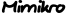
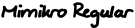
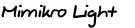

# 

*A human's interpretation of a machine mimicking human handwriting.*

Computers are notoriously bad in generating self-similar sequences like handwritten script: They lack a certain natural context-aware "randomness".

 Humans, on the other hand, are really bad at repetitive, precise tasks and are prone to introduce quirks and deviations over time.

Let's combine our weaknesses and team up for a new font!

Process
-------

1. Recurrent Neural Networks can generate convincing handwriting. The paper [Generating Sequences With Recurrent Neural Networks](https://arxiv.org/abs/1308.0850) by Alex Graves explains the process

2. No need to understand in in-depth!  
Instead, use [Sean Vasquez's implementation](https://github.com/sjvasquez/handwriting-synthesis) to generate seemingly handwritten text as SVG vector graphics.  
The recurrent neural network was trained using human examples, and therefore features many human-specific oddities:
   - Glyphs are more slanted towards the end of each row, as the writer's hand tends to rotate
   - Letter features (like a descenders and ascenders) are more pronounced or softened, depending on neighbouring characters

3. Use a [pen plotter](https://www.silhouetteamerica.com/shop/cameo) and ballpoint pen to draw them on paper sheets. This introduces jitters and opacity variations

4. Scan the results in a flatbed scanner, because you need every bit of resolution!

5. Trace every letter. In this step, opacity variations are translated into stroke-width variations to simulate different gray tones. Furthermore, a global slanting angle has to be chosen (we're not doing a cursive Garamond here, after all!)

6. Compose a font using eg. [Glyphs Mini](https://glyphsapp.com/glyphs-mini) to do the heavy lifting. Feel free to add ligatures and kerning tables, it may help to connect the letters

Results of the May 2019 Run
---------------------------

Download as…
- [.otf](Mimikro_Regular.otf)
- [.woff](Mimikro_Regular.woff)
- [.woff2](Mimikro_Regular.woff2)

Download as…
- [.otf](Mimikro_Light.otf)
- [.woff](Mimikro_Light.woff)
- [.woff2](Mimikro_Light.woff2)
